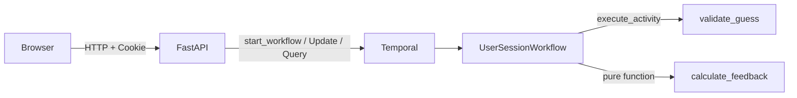

# Durable Wordle — Implementation Plan

## Current Status

| Step | Description | Status |
|------|-------------|--------|
| 1 | Project Scaffolding & Configuration | Complete |
| 2 | Models & Game Logic | Complete |
| 3 | Word Lists & Validation Activity | Complete |
| 4 | UserSessionWorkflow | Complete |
| 5 | FastAPI API & Session Management | Complete |
| 6 | Frontend Template (HTMX/Tailwind) | Complete |
| 7 | Worker & Docker Compose | Complete (pending docker-compose test) |

## Architecture Overview

Each browser session maps to one Temporal workflow. The workflow holds game state and runs until the game ends. No database — the workflow *is* the state.



Key Temporal patterns used:
- **Update** (`make_guess`): request/response with durable state mutation
- **Query** (`get_game_state`): read-only state access for page renders
- **Activity** (`validate_guess`): word list file I/O (side effect)

---

## Global Code Rules (apply to EVERY step)

These rules apply to all Python code written in any step. Read CLAUDE.md for full details.

- **ABOUTME**: Every `.py` file starts with a 2-line comment; first line prefixed `ABOUTME: `
- **Type hints**: All functions, all parameters, all return types. No `Any`. Use `X | None` not `Optional[X]`.
- **Docstrings**: RST format on all public classes, methods, and functions.
- **Imports**: Absolute imports only. No relative imports.
- **`__init__.py`**: Always empty. Never add code.
- **Variable names**: Descriptive only. No single-letter names (`i`, `j`, `x`, `c`). Use `letter_index`, `guess_letter`, `remaining_count`, etc.
- **Testing**: Test YOUR logic, not frameworks. Module-level mutable state needs `autouse` reset fixtures.

---

## Step 1: Project Scaffolding & Configuration

**Goal**: Set up the project structure, dependencies, tooling, and configuration module so all subsequent steps have a working foundation.

**NOTE**: The project uses `uv` for package management, `just` for task running, and the package is named `durable_wordle` under `src/` layout.

```text
1. Create pyproject.toml:
   - Create pyproject.toml with:
     - name: "durable-wordle"
     - Python >= 3.12
     - src layout (packages = [{include = "durable_wordle", from = "src"}])
     - Dependencies: temporalio, fastapi, uvicorn[standard], jinja2, python-multipart
     - Dev dependencies: pytest, pytest-asyncio, ruff, mypy
     - Ruff config: line-length 88, target Python 3.12
     - mypy config: strict = true
     - pytest config: asyncio_mode = "auto"

2. Create justfile with recipes:
   - `worker`: uv run python -m durable_wordle.worker
   - `server`: uv run uvicorn durable_wordle.api:app --reload
   - `test`: uv run pytest
   - `lint`: uv run ruff check src/ tests/
   - `format`: uv run ruff format src/ tests/
   - `typecheck`: uv run mypy src/
   - `check`: just lint && just typecheck && just test

3. Create package structure (empty __init__.py files):
   - src/durable_wordle/__init__.py
   - tests/__init__.py

4. RED: Write configuration tests:
   - Create tests/test_config.py:
     - Test that default config has temporal_host = "localhost:7233"
     - Test that default config has temporal_namespace = "default"
     - Test that default config has temporal_task_queue = "wordle-tasks"
     - Test that config reads DURABLE_WORDLE_TEMPORAL_HOST from environment
     - Test that config reads DURABLE_WORDLE_TEMPORAL_NAMESPACE from environment
     - Test that config reads DURABLE_WORDLE_TEMPORAL_TASK_QUEUE from environment

5. GREEN: Create src/durable_wordle/config.py:
   - ABOUTME comment at top of file
   - Define a Settings dataclass with three fields, type hints, and their defaults
   - RST docstring on the class and factory function
   - Factory function that reads from os.environ with DURABLE_WORDLE_ prefix
   - Absolute imports only; use `X | None` syntax if needed
   - Just enough to pass the tests

6. Run `uv sync` to install dependencies, then run `just check` to verify everything works.
```

---

## Step 2: Models & Game Logic

**Goal**: Define the core data types and implement `calculate_feedback` — the pure function that determines green/yellow/gray for each letter in a guess. This is the heart of Wordle logic and is highly testable with no external dependencies.

**NOTE**: `calculate_feedback` must handle duplicate letters correctly. For example, if the target is "APPLE" and the guess is "PAPAL", the feedback must account for letter frequency — not every matching letter gets yellow/green.

```text
1. RED: Write model construction tests:
   - Create tests/test_models.py:
     - Test that LetterFeedback enum has CORRECT, PRESENT, and ABSENT values
     - Test that GuessResult stores a word and a list of LetterFeedback values
     - Test that GameState initializes with target_word, empty guesses list, max_guesses=6, and status="playing"
     - Test that GameState.is_game_over returns True when status is "won" or "lost"
     - Test that GameState.is_game_over returns False when status is "playing"

2. GREEN: Create src/durable_wordle/models.py:
   - ABOUTME comment, RST docstrings on all public classes/methods, full type hints
   - LetterFeedback enum with CORRECT, PRESENT, ABSENT
   - GuessResult dataclass with word: str and feedback: list[LetterFeedback]
   - GameState dataclass with target_word: str, guesses: list[GuessResult], max_guesses: int = 6, status: str = "playing"
   - is_game_over property on GameState
   - Absolute imports only; `X | None` over Optional

3. RED: Write calculate_feedback tests:
   - Create tests/test_game_logic.py:
     - Test all correct letters (guess matches target exactly) → all CORRECT
     - Test all absent letters (no letters match) → all ABSENT
     - Test mixed feedback: some CORRECT, some PRESENT, some ABSENT
     - Test letter in wrong position → PRESENT
     - Test duplicate letter in guess where target has one: first match is CORRECT/PRESENT, second is ABSENT
       - Example: target="APPLE", guess="PAPAL" → [PRESENT, PRESENT, ABSENT, ABSENT, ABSENT] is wrong;
         must properly account for: P appears twice in target positions 1,3 (0-indexed: A=0,P=1,P=2,L=3,E=4)
         and guess has P at 0,2,... think through carefully
     - Test duplicate letter in guess where target has none of that letter → all ABSENT for that letter
     - Test target="HELLO", guess="LLONE" → L at pos 0 is ABSENT (only one L left after pos 1 gets it?), etc.
       Actually, let's use clearer examples:
     - Test target="AABBB", guess="XAAAA" → position 0:ABSENT, 1:CORRECT, 2:PRESENT, 3:ABSENT, 4:ABSENT
       (target has 2 A's; guess has 4 A's; pos 1 is exact match=CORRECT; pos 2 gets remaining 1 A=PRESENT; pos 3,4 get ABSENT)
     - Test case insensitivity: guess "Hello" and target "HELLO" should still work (normalize to uppercase)

4. GREEN: Create src/durable_wordle/game_logic.py:
   - ABOUTME comment, RST docstring, full type hints on all functions
   - Implement calculate_feedback(guess: str, target: str) -> list[LetterFeedback]
   - Algorithm:
     1. Normalize both to uppercase
     2. First pass: mark CORRECT matches, track remaining target letter counts
     3. Second pass: for non-CORRECT positions, check if letter exists in remaining counts → PRESENT, else ABSENT
   - CRITICAL: No single-letter variable names. Use descriptive names like `position`, `letter_index`, `guess_letter`, `target_letter`, `remaining_counts`, etc.
   - Absolute imports only
   - Just enough to pass tests

5. REFACTOR: Review calculate_feedback for clarity. Verify all variable names are descriptive (no `i`, `j`, `c`).

6. Run `just check` to verify everything passes.
```

---

## Step 3: Word Lists & Validation Activity

**Goal**: Create the curated word lists and the `validate_guess` Temporal activity that checks whether a guess is a valid 5-letter word.

**NOTE**: The activity reads from a bundled word list (file I/O = side effect), which is why it's an Activity rather than workflow code. Pure format checks (length, alphabetic) happen separately. Word selection uses `random.seed(date)` + `random.choice` for deterministic daily word picks.

```text
1. RED: Write word list tests:
   - Create tests/test_word_lists.py:
     - Test that answer list contains only 5-letter words
     - Test that answer list contains only alphabetic words
     - Test that answer list has between 200 and 500 words (reasonable range for curated list)
     - Test that valid_guesses list contains only 5-letter alphabetic words
     - Test that valid_guesses is a superset of answer list (every answer is also a valid guess)
     - Test that get_daily_word returns a word from the answer list for a given date
     - Test that get_daily_word returns the same word for the same date (deterministic)
     - Test that get_daily_word returns different words for different dates

2. GREEN: Create src/durable_wordle/word_lists.py:
   - ABOUTME comment, RST docstrings on public functions, full type hints
   - ANSWER_LIST: list of ~300 curated common 5-letter words (hardcoded list)
   - VALID_GUESSES: larger list of ~2000 valid 5-letter words (hardcoded list, superset of ANSWER_LIST)
   - get_daily_word(date: datetime.date) -> str: uses random.seed(date.toordinal()) + random.choice
   - is_valid_guess(word: str) -> bool: checks if uppercase word is in VALID_GUESSES set
   - Absolute imports only

3. RED: Write validate_guess activity tests:
   - Create tests/test_activities.py:
     - Test that validate_guess returns True for a word in the valid guesses list
     - Test that validate_guess returns False for a word not in the valid guesses list
     - Test that validate_guess is case-insensitive
     - Test that validate_guess returns False for empty string
     - Test that validate_guess returns False for wrong-length word

4. GREEN: Create src/durable_wordle/activities.py:
   - ABOUTME comment, RST docstrings, full type hints
   - Define ValidateGuessInput dataclass with guess: str (single-argument pattern per spec)
   - Implement validate_guess activity using @activity.defn
   - Activity normalizes to uppercase, checks length and alpha, then calls is_valid_guess
   - Use sync activity (file I/O from bundled list is fine as sync)
   - Absolute imports only

5. REFACTOR: Ensure word lists are loaded as frozensets for O(1) lookup.

6. Run `just check` to verify everything passes.
```

---

## Step 4: UserSessionWorkflow

**Goal**: Implement the core Temporal workflow that manages a single game session. This is where durability lives — the workflow holds game state, accepts guesses via Update, exposes state via Query, and completes when the game ends.

**NOTE**: Key Temporal patterns:
- Update handler (`make_guess`): validates format, executes validate_guess activity, calculates feedback, updates state, returns result
- Query handler (`get_game_state`): returns current board state (read-only)
- Workflow uses `workflow.unsafe.imports_passed_through()` to import activities
- Single-argument dataclass input pattern per spec constraints
- Workflow completes (returns) when player wins or exhausts all 6 guesses

```text
1. RED: Write workflow tests using WorkflowEnvironment:
   - Create tests/test_workflows.py:
     - Test that workflow starts and can be queried for initial game state (empty guesses, status="playing")
     - Test that submitting a valid guess via update returns a GuessResult with correct feedback
     - Test that submitting an invalid word (not in dictionary) via update raises an error / returns rejection
     - Test that submitting a guess with wrong length (not 5 letters) via update raises an error
     - Test that guessing the correct word sets status to "won" and workflow completes
     - Test that using all 6 guesses without winning sets status to "lost" and workflow completes
     - Test that submitting a guess after game is over raises an error
   - Use WorkflowEnvironment.start_local() with real activities (no mocking — the activity is just a list lookup)
   - Use unique task_queue and workflow_id per test (uuid4)

2. GREEN: Create src/durable_wordle/workflows.py:
   - ABOUTME comment, RST docstrings on the class and public methods, full type hints
   - Import activities with workflow.unsafe.imports_passed_through()
   - Absolute imports only; `X | None` over Optional; no single-letter variable names
   - Define WorkflowInput dataclass with target_word: str, session_id: str
   - Define MakeGuessInput dataclass with guess: str
   - Implement UserSessionWorkflow:
     - @workflow.defn class
     - __init__: initialize GameState
     - @workflow.run: accept WorkflowInput, store target word, wait until game is over using workflow.wait_condition, return final GameState
     - @workflow.update make_guess(input: MakeGuessInput) -> GuessResult:
       - Check game not over (raise ApplicationError if so)
       - Pure format checks: length == 5, all alpha (raise ApplicationError if not)
       - Execute validate_guess activity (raise ApplicationError if word not in dictionary)
       - Call calculate_feedback(guess, target_word)
       - Build GuessResult, append to state
       - Check win condition (all CORRECT) → set status = "won"
       - Check loss condition (len(guesses) >= max_guesses) → set status = "lost"
       - Return GuessResult
     - @make_guess.validator: check game not over and basic format (no state mutation)
     - @workflow.query get_game_state -> GameState: return current state

3. REFACTOR: Ensure workflow logic is clean. Verify all non-deterministic operations are in activities.

4. Run `just check` to verify everything passes.
```

---

## Step 5: FastAPI API & Session Management

**Goal**: Build the web layer that connects browsers to Temporal workflows. Cookie-based sessions, HTMX partial responses, and Temporal client integration.

**NOTE**: 
- Session ID is a UUID stored in an HttpOnly cookie
- Workflow ID format: `wordle-{date}-{session_id}` (e.g., `wordle-2026-04-04-abc123`)
- GET / renders the game board (queries existing workflow or shows empty board)
- POST /guess starts a workflow if needed, then sends Update
- The template rendering uses Jinja2 — create a minimal placeholder template in this step (full frontend comes in Step 6)

```text
1. Create templates/ directory and a minimal templates/index.html placeholder:
   - Just enough HTML to render game state variables (guesses, status, message)
   - Include a form that POSTs to /guess
   - This will be replaced with the full HTMX/Tailwind template in Step 6

2. RED: Write API tests using FastAPI TestClient:
   - Create tests/test_api.py:
     - Test that GET / returns 200 and sets a session_id cookie if none exists
     - Test that GET / reuses existing session_id cookie if present
     - Test that GET /health returns 200 with {"status": "ok"}
     - Test that POST /guess with no session cookie creates one and starts a game
     - Test that POST /guess with a valid word returns updated game board HTML
     - Test that POST /guess with an invalid word returns an error message in the response
     - Test that the workflow_id is derived from date + session_id
   - These tests need a running WorkflowEnvironment — use a pytest fixture that starts one
   - Create tests/conftest.py with:
     - workflow_environment fixture (session-scoped) using WorkflowEnvironment.start_local()
     - A fixture that starts a Worker in the background
     - A fixture that creates a FastAPI TestClient wired to the test Temporal client

3. GREEN: Create src/durable_wordle/api.py:
   - ABOUTME comment, RST docstrings on public functions, full type hints, absolute imports only
   - Create FastAPI app with Jinja2Templates
   - Implement get_or_create_session_id helper (reads/sets cookie)
   - Implement get_workflow_id(date, session_id) -> str helper
   - GET / route:
     - Get session_id from cookie
     - Try to query existing workflow for game state
     - If no workflow exists, render empty board
     - If workflow exists, render board with current state
   - POST /guess route:
     - Get session_id from cookie
     - Get guess from form data
     - Try to get workflow handle; if workflow not found, start a new one
     - Send guess as Update to workflow
     - Return rendered board partial (for HTMX swap)
   - GET /health route: return {"status": "ok"}
   - App startup: create Temporal client, store on app.state
   - Use config.py settings for Temporal connection

4. REFACTOR: Extract Temporal client management into clean lifecycle hooks.

5. Run `just check` to verify everything passes.
```

---

## Step 6: Frontend Template (HTMX/Tailwind)

**Goal**: Build the single-page game UI with HTMX for dynamic updates and Tailwind CSS for styling. Standard Wordle board layout with keyboard, color-coded feedback, and shareable results.

**NOTE**: This step is primarily frontend work. Testing is limited to verifying the template renders without errors and includes the right structural elements. The real testing happened in Steps 2-5.

```text
1. RED: Write template rendering tests:
   - Add to tests/test_api.py:
     - Test that rendered page contains a 6-row game grid
     - Test that rendered page contains a keyboard section
     - Test that a guess with CORRECT feedback renders with green styling class
     - Test that a guess with PRESENT feedback renders with yellow styling class
     - Test that a guess with ABSENT feedback renders with gray styling class
     - Test that a won game shows a success message and share button
     - Test that a lost game shows the target word and share button

2. GREEN: Create templates/index.html:
   - Full HTMX/Tailwind game UI:
     - DOCTYPE, viewport meta, Tailwind CDN, HTMX CDN script tags
     - Game header ("Durable Wordle")
     - 6x5 grid board showing submitted guesses with color-coded tiles:
       - Green (bg-green-500) for CORRECT
       - Yellow (bg-yellow-500) for PRESENT
       - Gray (bg-gray-500) for ABSENT
       - Empty cells for remaining guesses
     - Status messages (win/loss/error)
     - Text input + submit button, form POSTs to /guess via HTMX (hx-post="/guess", hx-target="#game-board", hx-swap="innerHTML")
     - On-screen keyboard showing letter states (which letters are known correct/present/absent)
     - Share button (copies emoji grid to clipboard) on game completion
     - Mobile-responsive layout
   - Create a partial template section for HTMX swaps (the board + keyboard + status that gets replaced on each guess)

3. Add template block for the HTMX partial response:
   - POST /guess should return just the game board partial, not the full page
   - Update api.py to render the partial template for POST responses

4. REFACTOR: Clean up template structure. Ensure accessibility basics (labels, aria attributes on interactive elements).

5. Run `just check` to verify everything passes.
```

---

## Step 7: Worker & Docker Compose

**Goal**: Create the Temporal worker entry point and Docker Compose configuration for running the full stack locally.

**NOTE**: The worker registers the UserSessionWorkflow and validate_guess activity. Docker Compose runs three services: Temporal dev server, the worker, and the FastAPI web app.

```text
1. Create src/durable_wordle/worker.py:
   - ABOUTME comment, RST docstrings, full type hints, absolute imports only
   - Import workflow and activity
   - Connect to Temporal using config settings
   - Create Worker with:
     - task_queue from config
     - workflows=[UserSessionWorkflow]
     - activities=[validate_guess]
     - activity_executor=ThreadPoolExecutor (for sync activity)
   - Run worker with asyncio.run()

2. Create Dockerfile:
   - FROM python:3.12-slim
   - Install uv
   - Copy project files
   - Run uv sync
   - Default CMD for web server (uvicorn)

3. Create docker-compose.yml:
   - temporal service: temporalio/auto-setup (dev server with ephemeral storage)
   - worker service: builds from Dockerfile, runs `uv run python -m durable_wordle.worker`, depends on temporal
   - web service: builds from Dockerfile, runs `uv run uvicorn durable_wordle.api:app --host 0.0.0.0`, depends on temporal and worker
   - Shared environment variables for DURABLE_WORDLE_TEMPORAL_HOST pointing to temporal service

4. Test locally:
   - Run `docker-compose up` and verify all services start
   - Verify game is playable in browser at localhost:8000

5. Run `just check` one final time to ensure all tests pass.
```

---

## Implementation Guidelines

### Temporal Python SDK Patterns (from SDK reference)

- **Workflow determinism**: No I/O, no `datetime.now()` (use `workflow.now()`), no `random` (use `workflow.random()`). All side effects go in activities.
- **Import pattern**: Use `with workflow.unsafe.imports_passed_through():` to import activity modules in workflow files.
- **Single-argument pattern**: Workflow and activity inputs are always a single dataclass.
- **Activity type**: Use sync activities with `ThreadPoolExecutor` for the word list lookup. Simpler and safer than async.
- **Update validators**: Must NOT mutate state or block. Read-only, raise to reject.
- **Testing**: Use `WorkflowEnvironment.start_local()` with real activities. Unique `uuid4()` for task queues and workflow IDs per test.

### Python Code Standards

- All files start with a 2-line ABOUTME comment (first line prefixed `ABOUTME: `)
- Type hints on all functions, parameters, and return types — no `Any`
- `X | None` over `Optional[X]` (PEP 604, Python 3.12+)
- RST-format docstrings on all public interfaces (Sphinx-compatible)
- Absolute imports only — no relative imports
- Empty `__init__.py` files — never put code in them
- Descriptive variable names — no single-letter names (`i`, `j`, `x`); use `letter_index`, `guess_index`, `remaining_count`, etc.
- Use method references for queries/updates, not string names
- Ruff for linting/formatting, mypy strict for type checking
- Module-level mutable state (dicts, lists, caches, sets) needs an `autouse` fixture that resets it between tests

### Testing Strategy

- **Unit tests**: `test_game_logic.py` (pure function), `test_models.py` (data types), `test_word_lists.py` (word data), `test_config.py` (configuration)
- **Activity tests**: `test_activities.py` using `ActivityEnvironment`
- **Workflow tests**: `test_workflows.py` using `WorkflowEnvironment.start_local()`
- **API tests**: `test_api.py` using FastAPI `TestClient` with test Temporal environment

## Success Metrics

- [ ] All tests pass with `just check` (lint + typecheck + test)
- [ ] Game is playable end-to-end in a browser
- [ ] Closing and reopening the browser tab preserves game state (durability)
- [ ] Same daily word for all sessions on the same date
- [ ] Correct green/yellow/gray feedback including duplicate letter handling
- [ ] Mobile-responsive UI with keyboard
- [ ] Share button generates emoji grid on win/loss
- [ ] Docker Compose starts all services with a single command
