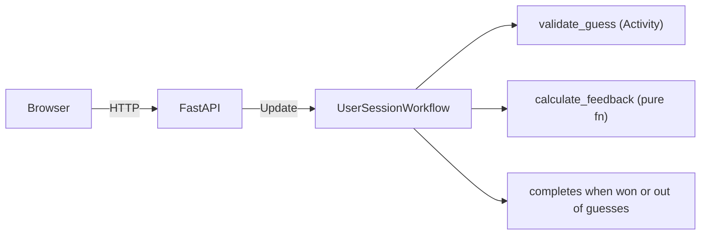

# Durable Wordle - Technical Specification

## Project Overview

Durable Wordle is a Wordle clone that teaches Temporal's core concepts in a 20-30 minute conference talk. The key insight: instead of storing game state in a database, each game session *is* a Temporal workflow. Close your browser, come back — the game is still there. That's durable execution.

## What This Teaches

| What the user does | Temporal concept |
|---|---|
| Visits the page, starts a game | `start_workflow` |
| Submits a guess | Update (request/response with durable state) |
| Word is checked against dictionary | Activity (side effect: file I/O) |
| Closes tab, reopens, game is still there | Durability — the whole point |
| Wins or uses all 6 guesses | Workflow completion |

That's it. Five concepts. No parent-child workflows, no entity workflows, no signals, no schedules.

## Technology Stack

- **Backend**: Temporal Python SDK, FastAPI
- **Frontend**: HTMX, Tailwind CSS
- **Deployment**: Docker Compose with Temporal dev server
- **Package management**: uv

## Architecture

### One Workflow Per Game Session

Each browser session gets a cookie. Each cookie maps to one Temporal workflow. The workflow holds the game state (target word, guesses so far, win/loss status) and runs until the game ends.



### Workflow: UserSessionWorkflow

- **Input**: Target word for the day, session ID
- **State**: List of guesses, feedback for each, win/loss status
- **Update handler** (`make_guess`): Validates the guess, calculates feedback (green/yellow/gray), updates state, returns result
- **Query** (`get_game_state`): Returns current board state for page renders
- **Completion**: Workflow returns final game result when game ends

### Activity: validate_guess

- Checks that the guess is in a bundled valid-words list (~2,000 common 5-letter words)
- This is an Activity because it reads from an external word list (side effect), keeping the workflow deterministic
- Pure format checks (length, alphabetic) happen in the workflow directly

### Word Selection

- A curated answer list (~300 words), one picked per day based on date
- `random.seed(date)` + `random.choice` — deterministic per day, no external dependency
- No AI generation, no external API calls — zero dependencies that can fail during a live demo

## Web Layer

### FastAPI Routes

- `GET /` — Render the game board. If a session cookie exists and a workflow is running, query its state. Otherwise show an empty board.
- `POST /guess` — Submit a guess. If no workflow exists for this session, start one. Then send the guess as an Update. Return the updated board via HTMX partial.
- `GET /health` — Simple health check for Docker.

### Session Management

- Cookie-based with `session_id` (UUID)
- HttpOnly, secure defaults
- Workflow ID derived from date + session ID (e.g., `wordle-2026-04-04-{session_id}`)
- Returning users on the same day get their existing workflow

### Frontend

- Standard Wordle game board layout
- HTMX swaps for guess submissions (no full page reloads)
- Tailwind CSS for styling
- Minimal JavaScript — keyboard input handling only
- Mobile-responsive
- Shareable results (emoji grid) on completion

## Project Structure

```
durable-wordle/
├── src/durable_wordle/
│   ├── __init__.py
│   ├── workflows.py        # UserSessionWorkflow
│   ├── activities.py       # validate_guess
│   ├── models.py           # GameState, GuessResult, LetterFeedback dataclasses
│   ├── game_logic.py       # calculate_feedback (pure function)
│   ├── word_lists.py       # Curated answer + valid guess word lists
│   ├── config.py           # Settings with env vars and defaults
│   ├── api.py              # FastAPI app, routes, template rendering
│   └── worker.py           # Temporal worker startup
├── templates/
│   └── index.html          # Single-page HTMX/Tailwind UI
├── tests/
├── docker-compose.yml
├── pyproject.toml
└── README.md
```

## Configuration

- `DURABLE_WORDLE_TEMPORAL_HOST`: Temporal server address (default: `localhost:7233`)
- `DURABLE_WORDLE_TEMPORAL_NAMESPACE`: Temporal namespace (default: `default`)
- `DURABLE_WORDLE_TEMPORAL_TASK_QUEUE`: Task queue name (default: `wordle-tasks`)

That's the full config. No API keys, no AI providers, no admin passwords.

## Development & Deployment

### Local Development

```bash
just worker    # Start the Temporal worker
just server    # Start the FastAPI dev server
just test      # Run tests
just check     # Typecheck + lint + test
```

### Docker Deployment

```bash
docker-compose up    # Starts Temporal dev server, worker, and web app
```

### Testing

- Workflow tests use `WorkflowEnvironment` from the Temporal SDK
- Activity tests use `ActivityEnvironment`
- API tests use FastAPI's test client
- All tests run with `uv run pytest`

## Implementation Constraints

- **Single argument pattern**: Workflow and activity inputs are always a single dataclass
- **Activity imports**: Use `workflow.unsafe.imports_passed_through()` in workflows
- **Type-safe queries**: Use method references, not string names
- **No `Any` types**: Strict type checking

## What's Intentionally Left Out

These are great Temporal patterns but wrong for a 25-minute intro talk:

- **Parent-child workflows** (daily game spawning sessions) — adds a layer of indirection that obscures the core "workflow = game" mental model
- **Entity workflows** (statistics aggregation) — interesting pattern, but requires explaining Signals and long-running workflows before you can even get to the point
- **Schedules** (auto-starting daily workflows) — operational concern, not educational
- **Timezone overlap logic** — operationally correct, pedagogically confusing
- **Admin interface** — doesn't teach Temporal
- **AI word generation** — external dependency that can fail during a live demo
- **User account workflows** — second entity workflow pattern, save for a workshop

Any of these could be added as "next steps" in the talk's closing slide or a follow-up blog post.
