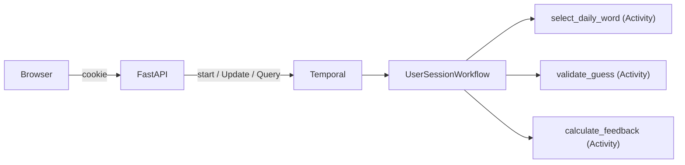

# CLAUDE.md

This file provides guidance to Claude Code (claude.ai/code) when working with code in this repository.

## Project

Durable Wordle — a Wordle clone where each game session is a Temporal workflow. No database; the workflow *is* the state. Built as a conference demo teaching five Temporal concepts: start_workflow, Updates, Activities, durability, and workflow completion.

**Design principle**: The workflow must be the complete game — fully playable via Temporal CLI (`temporal workflow start/update/query`) without the web UI. The API is just a UI skin. Never put game logic in the API layer.

## Stack

- **Backend**: Temporal Python SDK (`temporalio`), FastAPI, Jinja2
- **Frontend**: HTMX, Tailwind CSS (CDN)
- **Package management**: uv
- **Task runner**: just
- **Deployment**: Docker Compose with Temporal dev server

## Commands

```bash
just check      # lint + typecheck + test (the gate)
just test       # uv run pytest
just lint       # uv run ruff check src/ tests/
just typecheck  # uv run mypy src/
just format     # uv run ruff format src/ tests/
just worker     # start Temporal worker
just server     # start Temporal local dev server (temporal server start-dev)
just ui         # start FastAPI dev server (uvicorn --reload)
```

Run a single test: `uv run pytest tests/test_game_logic.py::test_name -v`

**Tip**: Run `just format` before `just check` after writing new files — auto-fixes line-length issues and avoids a manual edit round-trip.

## Architecture



- **One workflow per game session**: cookie holds session_id (UUID), workflow ID = `wordle-{date}-{session_id}` (daily) or `wordle-random-{game_id}` (random)
- **Two game modes**: daily (default, `workflow.now()` + `select_word` activity) and random (same activity, no date → `random.choice()`)
- **Update handler** (`make_guess`): waits for init, validates via activity, computes feedback via activity, mutates state, returns result
- **Update validator**: synchronous read-only guard — rejects if game over, wrong length, or non-alphabetic. Format validation lives here, not in activities.
- **Query handler** (`get_game_state`): returns current board state for rendering (read-only)
- **Three activities**: `select_word` (word selection — daily or random), `validate_guess` (external dictionary API via `requests`), `calculate_feedback` (green/yellow/gray feedback) — all sync, all appear in event history
- **HTMX error flow**: on invalid word, API returns 422 + `HX-Trigger` header — client JS shows toast + shake without replacing the board
- **Play again**: `GET /new-game` clears httpOnly cookies server-side and redirects — JS cannot modify httpOnly cookies

## Key Modules

- **`models.py`**: `LetterFeedback` enum (CORRECT/PRESENT/ABSENT), `GuessResult`, `GameState`, `WorkflowInput` (session_id + random_mode), `MakeGuessInput`, `ValidateGuessInput`, `SelectWordInput`, `CalculateFeedbackInput`
- **`workflow.py`**: `UserSessionWorkflow` — `run()` selects word via activity then waits, `make_guess` Update handler with `wait_condition` guard for init race, `validate_make_guess` validator, `get_game_state` Query handler
- **`activities.py`**: Three sync activities — `validate_guess` (dictionary API via `requests`, Temporal retries on failure), `select_word` (daily date-seeded or random selection), `calculate_feedback` (two-pass green/yellow/gray algorithm with duplicate-letter handling)
- **`api.py`**: `create_app()` factory — FastAPI with cookie sessions, Temporal client lifecycle via lifespan (or direct injection for tests), routes: `GET /`, `POST /guess`, `GET /health`. `create_production_app()` uses `temporalio.envconfig` for connection settings
- **`worker.py`**: Temporal worker entry point — connects via `temporalio.envconfig`, registers workflow and all three activities, uses `ThreadPoolExecutor` for sync activities

## Temporal Constraints

- Workflow code must be deterministic — no I/O, no `datetime.now()` (use `workflow.now()`), no `random` (use `workflow.random()`)
- Import activities and models in workflows with `workflow.unsafe.imports_passed_through()`
- Workflow and activity inputs use single dataclass pattern
- Enums in workflow/activity data types must use `StrEnum` or `IntEnum` — the default data converter silently fails with `(str, Enum)`
- Update validators must not mutate state, must not block, cannot be async, cannot call activities
- When workflow has async initialization (activity call before `wait_condition`), update handlers must guard with `await workflow.wait_condition(lambda: self._game_state is not None)`
- `WorkflowUpdateFailedError` wraps the real error in `__cause__` — use `str(err.__cause__)` to extract the actual `ApplicationError` message
- For `temporalio.envconfig`, use `ClientConfigProfile.load(config_source=Path(...))` — `str` is treated as TOML content, `Path` as a file path. Project uses `temporal.toml` at repo root
- Sync activities require `ThreadPoolExecutor` on the worker

## Code Conventions

- `src/durable_wordle/` layout — workflow.py and activities.py in separate files (SDK sandbox requirement)
- All files start with 2-line ABOUTME comment (first line prefixed `ABOUTME: `)
- Strict mypy — no `Any` types
- Type hints on all functions, parameters, and return types
- `X | None` over `Optional[X]` (PEP 604, Python 3.12+)
- RST-format docstrings on all public interfaces
- Absolute imports only — no relative imports
- Empty `__init__.py` files — never add content to them
- Descriptive variable names — no single-letter names (`i`, `j`, `x`); use `line_index`, `letter_index`, etc.
- Use method references for queries/updates, not string names
- Config via Temporal's `envconfig` (`TEMPORAL_ADDRESS`, `TEMPORAL_NAMESPACE` env vars) + `TEMPORAL_TASK_QUEUE` for app-specific queue name

## Testing

- **Workflow tests**: `WorkflowEnvironment.start_local()` with real activities, unique `uuid4()` task queues per test. Use `random_mode=True` for predictable test flows; discover target word via query. Register all three activities in every test Worker
- **Activity tests**: `ActivityEnvironment` for isolated activity testing. All activities are sync, so `ActivityEnvironment.run()` returns directly — do not `await` it
- **API tests**: `httpx.AsyncClient` with `ASGITransport` + inline Workers per test (not fixture-based — ASGITransport doesn't trigger lifespan, and fixture workers cause event loop issues). Set `app.state` directly for test injection via `create_app(temporal_client=...)`
- **Game logic tests**: `test_game_logic.py` tests `calculate_feedback` via `ActivityEnvironment` (9 tests covering duplicates, case handling, etc.)
- **Dictionary API mock**: `autouse=True` fixture in `conftest.py` patches `requests.get` globally — returns 200 for bundled word list words, 404 otherwise. Prevents rate limiting from the external API
- **Post-completion updates**: Sending an update to a completed workflow raises `RPCError` (not `WorkflowUpdateFailedError`) — catch both when testing
- pytest-asyncio with `asyncio_mode = "auto"`
