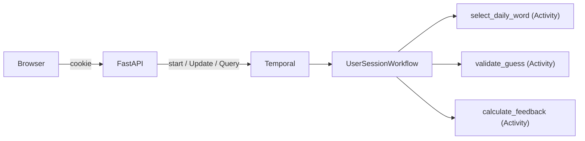

# Durable Wordle

A Wordle clone where each game session is a [Temporal](https://temporal.io) workflow. No database — the workflow *is* the state. Built as a conference demo teaching core Temporal concepts through a game everyone already knows how to play.

Close the browser, reopen it, and your game is still there. That's durable execution.

## Temporal Concepts Demonstrated

| Concept | What It Does Here | Where to Look |
|---|---|---|
| **Start Workflow** | Each session starts a workflow; deterministic ID reconnects returning players | `api.py` → `_get_or_start_workflow()` |
| **Updates** | Guesses mutate workflow state and return feedback; a validator rejects bad input before history is written | `workflow.py` → `make_guess()` |
| **Queries** | Read-only game board retrieval, safe to call any time | `workflow.py` → `get_game_state()` |
| **Activities** | Word selection, guess validation (dictionary API), and feedback calculation — each visible in event history | `activities.py` |
| **Durable Execution** | Workflow holds state in memory; worker restarts replay history to rebuild state with zero data loss | `workflow.py` → `run()` |

## Architecture



- **One workflow per game session** — cookie holds a session UUID, workflow ID = `wordle-{date}-{session_id}`
- **No database** — the workflow's event history is the source of truth
- **Daily or random mode** — daily mode uses `workflow.now()` + an activity; random mode uses `workflow.random()` for deterministic replay
- **Fully playable via CLI** — the workflow is the complete game; the web UI is just a skin (see [Playing via Temporal CLI](#playing-via-temporal-cli))

## Prerequisites

- **Python 3.12+**
- **[uv](https://docs.astral.sh/uv/)** — Python package manager
- **[just](https://github.com/casey/just)** — task runner
- **[Temporal CLI](https://docs.temporal.io/cli)** — for the local dev server

### Install Temporal CLI

**macOS:**
```bash
brew install temporal
```

**Linux:**
```bash
# Download from https://temporal.download/cli/archive/latest?platform=linux&arch=amd64
# Extract and add `temporal` to your PATH
```

## Running Locally (without Docker)

The easiest path is one terminal:

```bash
uv sync
just dev
```

This starts the Temporal dev server, the Temporal worker, and the FastAPI web
server together. Open **http://localhost:8000** to play. The Temporal UI is
available at **http://localhost:8233**. The health check endpoint is
**http://localhost:8000/health**.

If you prefer to run each process separately, use three terminal windows:

### Terminal 1: Start Temporal dev server

```bash
just server
```

This starts a local Temporal server at `localhost:7233` with an ephemeral SQLite database and the Temporal UI at `http://localhost:8233`.

### Terminal 2: Start the worker

```bash
uv sync
just worker
```

The worker connects to Temporal and polls for workflow tasks. It registers the `UserSessionWorkflow` and all three activities.

### Terminal 3: Start the web server

```bash
just ui
```

Open **http://localhost:8000** in your browser and play.

### Configuration

Connection settings use Temporal's standard [`envconfig`](https://docs.temporal.io/develop/environment-configuration) system — environment variables, TOML profiles, or both. Defaults work for local development out of the box.

| Variable | Default | Description |
|---|---|---|
| `TEMPORAL_ADDRESS` | `localhost:7233` | Temporal server address |
| `TEMPORAL_NAMESPACE` | `default` | Temporal namespace |
| `TEMPORAL_TASK_QUEUE` | `wordle-tasks` | Task queue name (app-specific) |

For Temporal Cloud, set `TEMPORAL_ADDRESS`, `TEMPORAL_NAMESPACE`, and `TEMPORAL_API_KEY` (or mTLS certs). See the [Temporal docs](https://docs.temporal.io/develop/python/temporal-client#connect-to-temporal-cloud) for details.

## Playing via Temporal CLI

The workflow is the complete game — you don't need the web UI. With a Temporal dev server and worker running, you can play entirely from the command line.

### Start a game (random word)

```bash
temporal workflow start \
  --type UserSessionWorkflow \
  --task-queue wordle-tasks \
  --workflow-id wordle-cli-game \
  --input '{"session_id": "cli-test", "random_mode": true}'
```

### Make a guess

```bash
temporal workflow update \
  --workflow-id wordle-cli-game \
  --name make_guess \
  --input '{"guess": "CRANE"}'
```

The response shows the feedback for each letter:

```json
{"word": "CRANE", "feedback": ["absent", "absent", "absent", "absent", "correct"]}
```

### Check the board

```bash
temporal workflow query \
  --workflow-id wordle-cli-game \
  --name get_game_state
```

Returns the full game state — target word, all guesses with feedback, status, and remaining guesses.

### View the event history

```bash
temporal workflow show --workflow-id wordle-cli-game
```

Every step is visible: the word selection activity, each guess's validation and feedback activities, and the final game result.

### Start a daily game (same word for everyone)

```bash
temporal workflow start \
  --type UserSessionWorkflow \
  --task-queue wordle-tasks \
  --workflow-id wordle-daily-$(date +%Y-%m-%d)-player1 \
  --input '{"session_id": "player1"}'
```

Omitting `random_mode` (or setting it to `false`) uses the daily word — determined by `workflow.now()` and an activity, so every player on the same day gets the same word.

## Development

```bash
just check      # lint + typecheck + test (the gate)
just dev        # start Temporal server + worker + web UI
just server     # start Temporal local dev server
just worker     # start Temporal worker
just ui         # start FastAPI web server
just test       # run tests
just lint       # ruff check
just typecheck  # mypy strict
just format     # ruff format
```

Run a single test:
```bash
uv run pytest tests/test_game_logic.py::test_all_correct_letters -v
```

## Running with Docker Compose

If you'd rather not install Temporal locally, Docker Compose runs everything for you — Temporal server, worker, and web app:

```bash
docker compose up --build
```

Open **http://localhost:8000** to play. The Temporal UI is available at **http://localhost:8233**.

To stop:
```bash
docker compose down
```

## Tech Stack

- **Backend:** Temporal Python SDK, FastAPI, Jinja2
- **Frontend:** HTMX, Tailwind CSS (CDN)
- **Package management:** uv
- **Task runner:** just
